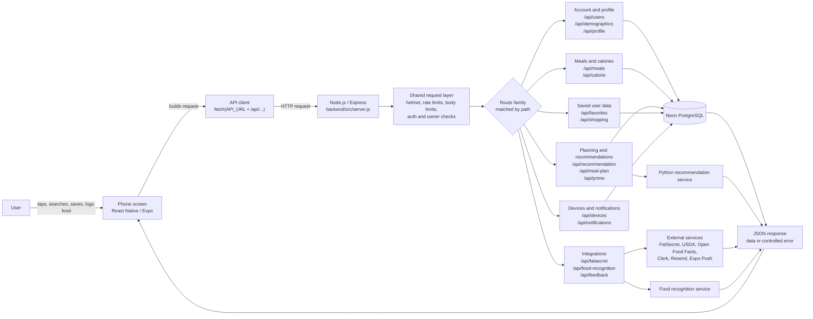

# ⚙️ GoodHealthMate Backend (Node.js)

This folder contains the Node.js / Express backend for the meal planning app. It is the integration layer between the mobile client, PostgreSQL, push notifications, feedback handling, and the Python recommendation service.

## Backend Request Flow

The phone app does not talk directly to the database or third-party services. A user action on a phone screen becomes an API request, the Node.js / Express backend receives it, shared middleware protects and normalizes the request, then the matching route handler calls the right database table, service, or external API and returns a stable JSON response to the app.



Request contract:

1. The app screen asks the backend for one clear action, such as loading meals, saving a favourite, scanning food, or updating a shopping list.
2. `server.js` is the front door: it applies platform checks, rate limits, body-size limits, JSON parsing, and then mounts the `/api/...` route families.
3. Private user-data routes verify the Clerk identity and scope database work to the signed-in user, so one user cannot read or change another user's rows.
4. Route handlers return predictable JSON. Successful requests return the data the phone needs; failed requests return a controlled error response instead of crashing the app.

## Responsibilities

The backend is responsible for:

- serving the main REST API used by the mobile app
- reading and writing user data in PostgreSQL
- resolving Clerk-backed user identity on protected flows
- calling the machine learning service for recommendation generation and cache priming
- handling notification device registration and push delivery helpers
- sending feedback email and storing recommendation feedback
- proxying food-recognition requests so the mobile app does not call the recognition service directly
- exposing health endpoints for local and hosted deployments

## Route Surface

The API is split by feature area under `src/routes/`.

Main route groups:

- health: `GET /`, `GET /health`, `GET /api/health`
- users: `POST/GET` flows under `/api/users`
- demographics: `/api/demographics`
- meals: `/api/meals`
- favorites: `/api/favorites`
- shopping: `/api/shopping`
- calories: `/api/calorie`
- profile: `/api/profile`
- devices: `/api/devices`
- notifications: `/api/notifications`
- feedback: `/api/feedback`
- FatSecret integration: `/api/fatsecret`
- food recognition: `/api/food-recognition`
- recommendations: `GET /api/recommendation/:clerkId`, `POST /api/recommendation/feedback`
- meal planning: `/api/meal-plan`
- recommendation warmup: `POST /api/prime`, `GET /api/prime/status/:clerkId`

Two recommendation-related behaviors are important operationally:

- the backend normalizes live recommendation responses before returning them to the app
- the prime route can either queue warmup quickly or wait for warmup completion when `waitForWarmup` is requested

## Tech Stack

- Node.js with native ESM modules
- Express 5
- Neon PostgreSQL
- Drizzle ORM and Drizzle Kit
- Clerk backend SDK
- Nodemailer
- Expo push support through `expo-server-sdk`
- Cron-based jobs for production reminders and summaries

## Environment Variables

This service does not currently ship with a checked-in `.env.example`, so the runtime contract is documented here.

Core variables:

- `PORT`: backend port, defaults to `5000`
- `DB_URL`: PostgreSQL connection string used by Neon / Drizzle
- `NODE_ENV`: set to `production` in hosted environments
- `CLERK_SECRET_KEY`: required for Clerk-backed server operations
- `NOTIFICATIONS_CRON_ENABLED`: optional override; set to `true` to start scheduled notification jobs even outside production/Railway
- `NOTIFICATIONS_CRON_DISABLED`: optional override; set to `true` to prevent scheduled notification jobs from starting
- `NOTIFICATION_TIME_ZONE`: optional notification scheduler time zone, defaults to `Australia/Adelaide`
- `INTERNAL_TRIGGER_SECRET`: optional shared secret for ops-only endpoints such as `/api/internal/run-reminders` and `/api/health/runtime`

Recommendation service variables:

- `ML_SERVICE_URL`: optional; only set when an external recommendation service is active
- `ML_SERVICE_PRIME_URL`: optional; only set when an external recommendation prime service is active
- `RECOMMENDATION_DEBUG_LOGS`: set to `1` to log detailed recommendation timing and response summaries

Feature-specific variables:

- `FATSECRET_CLIENT_ID`: required for FatSecret-backed lookups
- `FATSECRET_CLIENT_SECRET`: required for FatSecret-backed lookups
- `FOOD_RECOGNITION_API_URL`: required when food recognition is active; backend-only URL for the FastAPI food recognition service
- `FOOD_RECOGNITION_API_TOKEN`: required when food recognition is active; server-only shared token sent to the Food Recognition API as `x-food-api-token`
- `RESEND_API_KEY`: required for the recommended production feedback mail flow; create this in Resend and store it only in Railway or local `.env`
- `FEEDBACK_TO_EMAIL`: required recipient for app feedback, for example `feedback@dreamingstudio.net`
- `FEEDBACK_FROM_EMAIL`: required sender identity for Resend, for example `GoodHealthMate Feedback <feedback@mail.dreamingstudio.net>`
- `EMAIL_USER`: optional Gmail SMTP fallback sender account; not needed when `RESEND_API_KEY` is set
- `EMAIL_PASSWORD`: optional Gmail SMTP fallback app password; not needed when `RESEND_API_KEY` is set
- `RATE_LIMIT_FATSECRET_MAX`: optional `/api/fatsecret` per-minute IP limit, defaults to `60`
- `RATE_LIMIT_THEMEALDB_MAX`: optional `/api/themealdb` per-minute IP limit, defaults to `60` (split from `RATE_LIMIT_FATSECRET_MAX` on 2026-07-20 so TheMealDB browsing and FatSecret food/recipe search no longer share one bucket)
- `RATE_LIMIT_FOOD_RECOGNITION_MAX`: optional `/api/food-recognition` per-minute IP limit, defaults to `30`

## Local Development

### Install

```bash
npm install
```

### Run In Development

```bash
npm run dev
```

### Run In Production Mode Locally

```bash
npm start
```

### Database Push

```bash
npm run db:push
```

### Inspect A User Record

```bash
npm run users:inspect
```

## Recommendation Flow

The recommendation path is intentionally split:

1. the backend loads the user, demographics, active calorie goal, favorites, and feedback profile
2. it calls the ML service with that context
3. it reshapes the ML payload into a stable API response for the mobile app
4. it stores explicit user feedback separately through the feedback endpoint

The backend also performs warmup-related work on startup:

- recommendation feedback storage bootstrap
- recommendation dependency warmup

## Health And Hosting Notes

The backend now returns a stable JSON payload on all of these paths:

- `/`
- `/health`
- `/api/health`

That is important for hosts such as Railway, where platform probes often hit `/` or `/health` even if the application originally only exposed `/api/health`.

Unmatched `GET` and `HEAD` requests are sampled into warning logs so future probe mismatches can be identified without spamming logs.

## Cron Behavior

Cron jobs are started when the backend is running in production, when Railway runtime variables are present, or when `NOTIFICATIONS_CRON_ENABLED=true`.

That means:

- local development will not automatically start reminder and summary jobs unless you explicitly enable them
- hosted deployments should be treated as single-process schedulers unless you intentionally split cron into a dedicated worker topology
- `NOTIFICATIONS_CRON_DISABLED=true` wins over all other scheduler start conditions
- if the host fully sleeps the Node process at the scheduled time, in-process cron cannot fire until the service wakes

## Railway Deployment Notes

Recommended deployment checklist:

1. set `NODE_ENV=production`
2. configure `DB_URL`, `CLERK_SECRET_KEY`, and any required email or FatSecret credentials
3. point `ML_SERVICE_URL` and `ML_SERVICE_PRIME_URL` at the deployed ML service
4. verify `GET /health` and `GET /` return `200`
5. verify `POST /api/prime` and `GET /api/prime/status/:clerkId` behave correctly against the live ML service
6. confirm notification cron behavior is acceptable for the number of running backend instances
7. optionally set `NOTIFICATIONS_CRON_ENABLED=true` for an explicit scheduler on switch, or `NOTIFICATIONS_CRON_DISABLED=true` when a separate worker owns scheduled notifications

## Workspace Relationship

This backend is designed to sit between the sibling projects:

- `../meal_app` consumes this API directly
- `../machine_learning` provides recommendation generation and prime status responses

If you deploy services independently, keep the backend-to-ML URLs in sync with the ML host.
